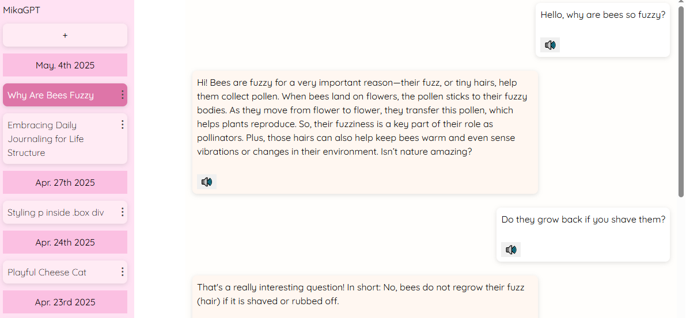

# MikaGPT

ChatGPT-like UI you can run locally. Uses [Flask](https://flask.palletsprojects.com/en/stable/) as backend. Requires internet connection and LLM API key to run (or, technically, locally hosted LLM too, but requires additional configuration which will not be documented here).

## Features
- Runs on Flask backend via Python, with web interface frontend for easy use. 
- Manage multiple chats.
- Cute pink UI.
- Good personality (customizable).
- Vision and image gen support (requires compatible models).
- Locally run TTS synthesis (requires Piper installation).
- Chat compression system for unlimited chat length.
- Layered long-term memory system for better context retention.

### The Chat Compression
Basically, when the chat token length exceeds the user specified limit, chat will automatically be compressed while retaining as much context as possible. Compression happens silently to user, and it offers seamless continuation of the chat, giving an illusion of unlimited chat while keeping the token count low.

### Long-term Memory
MikaGPT has 2 special long-term memory system called **core memory** and **archival memory**. They persist beyond chat compression. Both of these memories are managed per-conversation, which means they do not carry over to another chat. Every chat will have a fresh start with default core memory and no archival memory. I do not plan to make these memories global across all chat, as it is designed to be this way.

**Core memory** is a single system prompt that is always referenced by the AI. It stores important information like the identity of both the AI and the user, AI personality traits, key information about ongoing event and such. It is dynamically managed and updated by the AI, and update event can occur on every message.

**Archival memory** stores semantic memories distilled from the conversation. Archival memory is stored in an external SQLite database, and is referenced as needed when the recall is triggered by the AI. Recall is done by performing a similarity match using text embedding vectors. All of this is done locally. Archival memory is updated only during the chat compression, so it won't really be useful until chat has gone through few compressions.

Concept behind this memory system is largely inspired by the implementation of [Letta/MemGPT](https://github.com/letta-ai/letta) and [this paper](https://doi.org/10.48550/arXiv.2310.08560), so huge thanks to the devs and authors.

## Installation
### Create a virtual environment (optional, but recommended)
Run this in root directory.
`python -m venv ./venv`
Activate the venv from cmd.exe.
`venv/Scripts/activate.bat`

### Install requirements
`pip install -r requirements.txt`

### Install Piper TTS
Get the Piper binary from [here](https://github.com/rhasspy/piper), and unzip the content in to root directory. Path to piper.exe should be like:
`./piper/piper.exe`
Download and put voice files of your choice in the `./voices`. Make sure to edit `VOICE_PATH` in `./api/constants.py` so that it matches your chosen voice file. 

### Add API key
Create a file called `./apikey_openai.txt` or `./apikey_google.txt`, paste your openai/google API key inside.

### Configure Model
You can either use OpenAI models or Google models. Google models as of now can be used for free (but they will collect your data unless you pay). OpenAI models require paid API access (pretty affordable though).

`./api/constants.py` for model configurations. See the source for further information.

### Edit System Prompts
Inside `./static_prompts`, you can edit the system prompt to change the behavior and personality of the AI. Only edit the `default_core_memory.py`, which contains default core memory every chat will be initialized with. This is where you put all the persona/personality of the AI.

Other prompt files are used to interface the AI with the backend system, so I advise against editing them unless you REALLY know what you're doing. Things can break.

## Run
Run the provided `run.bat`

Or, alternatively, activate the virtual environment via shell and run the following command.

`python app.py`

In either method, it should give you a localhost URL in the console to access from your browser.

**WARNING** do NOT try host this on remote server, it is not secure. This app is intended for local use only.